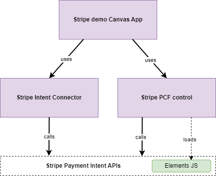

# Stripe payments PCF for Canvas Power App

This repo contains a solution for processing credit card payments via canvas Power Apps in Power Platform. It consists of:
* PowerApps Component Framework (PCF) control **tema_Technomancy.StripePayments3** embedding Stripe Elements UI and logic. 
* Custom connector **StripePaymentIntents** that integrates for Payment Intent Stripe API
* Two simple demo canvas Power Apps:
* * **StripePaymentsDemo** showing how to use these to process card payments.
* * **DonationsDemo** showing the process of auto-confirma payments and [MOTO (mail order / telephone order)](https://support.stripe.com/questions/mail-order-telephone-order-(moto)-transactions-when-to-categorize-transactions-as-moto) transactions. 



## Installation

Before you begin, you will need a Stripe pyments account. You can [create one here](https://dashboard.stripe.com/register) – it’s free for testing purposes.

You may install the components of this solution in 2 ways:
* Import the pre-packaged Power Platform solutions in this repo's **"build"** folder to deploy the components - this is the easiest and recommended way. You can use either managed solutions or unmanaged ones, if want to make some changes on the Power Platform side.  
* Use the source code to build and deploy the components. This is recommended only if you want to actually make changes in the solution code. 

### Import the pre-packaged Power Platform solutions

Download and import the solution packages including the custom connector and PCF component:
* [Download managed solution](build/StripePCF_1_4_managed.zip)
* [Download unmanaged solution](build/StripePCF_1_4.zip)

You can also download and import a sample demo canvas app that uses these components and contains the formulas explained later in the section [Setup and use](#setup-and-use):
* [Download sample apps unmanaged solution](build/StripePCFDemo_1_4.zip)

Don't forget to click *"Publish all customizations"* for the new changes to be available in the environment.

Skip the next section *"Build from the source code"* and move on to the [**Setup and use**](#setup-and-use) section. 

### Build from the source code

Prerequsites: 
* Windows 10 or later with [.NET Framework 4.6.2](https://dotnet.microsoft.com/en-us/download/dotnet-framework/net462) (unfortunately, PCF doesn't support yet build on Mac due to use of this legacy framework version)
* [NodeJS 20 + NPM](https://nodejs.org/en/download)
* Visual Studio Code
* Power Platform Tools extension for VS Code (microsoft-IsvExpTools.powerplatform-vscode), containing [Power Platform CLI](https://learn.microsoft.com/en-us/power-platform/developer/cli/introduction). I used version v2.0.21 of the extension as I had some issues with the latest one v2.0.25.

1. Clone this repository:

       git clone https://github.com/andrew-grischenko/StripePaymentsPCF

2. Change the directory and install the Node dependencies 

       cd StripPaymentsPCF
       npm install

3. After you made the changes required, if any, build the PCF component and run it in the local environment to test:

       npm run build
       npm start watch

4. When you are happy with the behaviour, create an authentication profile to connect Power Platform CLI to your environment:

       cd .\Solutions\
       pac auth create -n <name of the profile of your choice> -env <environment id or name>
       pac auth select -i <index of the newly created profile>

5. Build, package and deploy the solution. Please note, you need to increment the PCF control version every time for the changes to take effect!

       pac pcf version -pv <increment version number every time>
       dotnet build
       pac solution import

6. After the first time setup of the solution as per the above steps, you can make updates directly to the component using the *"pac push"* command:
       
       pac pcf push --publisher-prefix <your publisher prefix>

Continue to the next section to set up the components of the solution.
 
## Setup and use

### Set up the custom connector StripePaymentIntents ###

1. Create a new or open an existing Canvas App and in the left panel use "Add data" – find the **StripePaymentIntents** connector (added by the above steps):


Please do NOT use the standard Stripe connector as it doesn’t provide the required payment API methods:


2. When a right side panel open asking for on API key, specify a connection string as the following:

       Bearer <your_stripe_api_secret_key>

where:
* **Bearer** (and the following one space character) – the required authentication keyword.
* **<your_stripe_api_secret_key>** – the secret key from the Stripe account Dashboard (usually starting with "sk_")

You get the Stripe secret keys from the developers dashboard in Stripe account:


### Setup the PCF component StripePayments ###

1. Before you can start using the component in your power app, make sure that the custom components for Power Apps are enabled as below. You can find this option in your environment settings and for new environments it's **Off** by default. Turn it **On** and don't forget to click *Save* at the bottom of the page.  


2. Import the PCF code component into your canvas app:

* On the left menu panel select menu *Insert* and find the *Get more components* at the bottom of the panel
* Select the *"Code"* tab
* Select the **StripePayments** component and import it
* On the left panel, find the *Insert* command ("plus" icon) and in the section *Code components* find the component **StripePayments3** and add it to the app screen.


3. Set the **StripeClientKey** attribute of the component with the **Publishable key** from your Stripe account


4. Set the **Customer** attribute with a customer reference as a string as per your business logic (optional). Please note, the value of this field will be set to the **billing_details.name** property of the Stripe payment object.

5. Setup the visual appearance of the control (optional):

* **CardFontSize** – font size of the card number capture element
* **ButtonFontSize** – font size for the Pay button
* **ErrorFontSize** – font size of the error messages

The next steps will depend on which flow you will use:
* Regular payment flow when PaymentIntent object is created **before** the credit card details are captured. 
* Auto confirmation, required for MOTO payments, when PaymentIntent object is created **after** the credit card details are captured and the PaymentIntent is confirmed automatically.

### Regular payment flow (no auto confirmation) ###

6. Before your payment screen is shown and the payment amount is defined, e.g. on the *Next* button of the previous screen, add the formula to create the **PaymentIntent** object:

       Set(payment_intent, StripePaymentIntent.CreatePaymentIntent({ 
           amount: price * 100, 
           currency: "aud", 
           description: "test payment"
       }));
   
where:
* **payment_intent** – the variable to be used on the next step
* **StripePaymentIntent** – the custom connector object
* **amount** – the numeric value of the payment amount in hundredths of currency (e.g. cents). Please note, it cannot be less or more than [the specified limits on payment amount](https://stripe.com/docs/currencies#minimum-and-maximum-charge-amounts), otherwise, you will get an error.
* **currency** – currency code, must be [one supported by Stripe](https://stripe.com/docs/currencies).
* **description** – any description of your payment as you need it (can be empty)

7. Set the properties of the **StripePayment** component:
*  **PaymentIntentClientSecret** to use the PaymentIntent’s object’s **client_secret** value which will be set by the previous code:

       payment_intent.client_secret

* **AutoConfirm**: Off for this flow.

8. The processing of card payment is initiated when users clicks "Pay" button and this is handled transparently to the application code. There is no card details going through the application backend and you have no control of this flow. What you do have control is handling of the events. 

9. Handle the payment events – success and errors – with **OnChange** handler of the component by verifying the PaymentStatus attribute, e.g.

       If(StripeWidget.PaymentStatus = "completed", Navigate(Receipt)) 
       


Alternatively, you can also capture the charge record as the following (see StripePcfDemo app):
```
        If(
            StripeWidget.PaymentStatus = "completed",
            Set(
                charge_object,
                StripePaymentIntent.GetCharges({
                    payment_intent: payment_intent.id
                    })
            );
            Navigate(Receipt)
        )
```

Then, you can access charge id as `First(charge_object).id` and amount captured as `First(charge_object).amount_captured` etc. 
please note, the charge object is limited to a few properties only: `id`, `amount`, `amount_captured`, `amount_refunded`.

10. For test integration, you can use the test card numbers with any future expiry date and any 3 digit CVV code. See here for more test cards: https://stripe.com/docs/testing:
* **“4242424242424242”**  - successful payment
* **“4000000000000002”** - declined payment

11. You can use **Reset** property to reset the status of the Stripe component. This property works as a trigger when is set from "false" to "true". It has no effect if the property doesn't change or changes from "true" to "false". In order to reset the payment component, set the property value to refer to a variable and set the value of the variable to "true" and then back to "false". 

### Auto confirmation and MOTO flow ###

This flow does not use payment intent client secret as the payment intent is created after the card details are submitted. The submission of the credit card details by the component doesn't really confirm a payment yet, but provide a "payment method id" reference used at the next steps. 

12. You will need to turn on Formula-level error managemtn in Power App. This festure is off by default and is located in Settings > Upcoming features > Preview:


13. Set the properties of the **StripePayment** component: 
* **AutoConfirm**: On for this flow.

14. Once the card details submitted by a user, you would need to do 2 things:
* Initiate CreatePaymentIntent on the connector to actually process the payment  
* Handle success and errors. This is much more complicated handling in Power App as the payment processing declines are returned as API errors (HTTP status 402, for example) which causes Power App to throw an error if not handled properly. 

To do this, you can use the following sample formula in Power Apps **OnChange** handler of the component by verifying the PaymentStatus attribute and errors. Please note use of MOTO payments, if this is required for your use-case. 
```
If(
    StripeWidget.PaymentStatus = "submitted",
    Set(
        ApiResponse,
        StripePaymentIntent.CreatePaymentIntent(
            {
                amount: DonationAmount * 100,
                currency: "aud",
                description: "",
                confirm: true,
                payment_method: StripeWidget.PaymentMethodId,
                'payment_method_options[card][moto]': true
            }
        )
    );
    IfError(
        ApiResponse,
        With(
            {error_clue: "StripePaymentIntent.CreatePaymentIntent failed:"},
            Set(
                PaymentError,
                Text(
                    ParseJSON(
                        Right(
                            FirstError.Message,
                            Len(FirstError.Message) - Len(error_clue)
                        )
                    ).error.message
                )
            )
        ),
        If(
            ApiResponse.status <> "succeeded",
            Set(
                PaymentError,
                Concatenate(
                    "Coluld not process the payment, reason: ",
                    ApiResponse.status
                )
            ),
            Navigate(Receipt)
        )
    );
)
```

Use a Label component, for example, to display the error message from "PaymentError" variable. See the demo app **Stripe Donations with MOTO** for more details.

14. Use [test card numbers](https://stripe.com/docs/testing) to verify various scenarios, positive and negative. Spcifically, to test MOTO payment use **4000002500003155** - it should succeed when moto=true and fail with "requires_action" when moto=false. 

## Demo canvas Power App ##

You can find two sample demo Canvas apps in the [sample app unmanaged solution](build/StripePCFDemo_1_4.zip). 

1. Import the solution and publish all customizations. 

2. Find and edit the canvas app **StripePaymentsDemo** or **Stripe Donations with MOTO**. When you open the apps, you may get the warning window as below when opening the app for edit. This doesn't happen for a published app though.


3. Click *"Don't allow"* in the *StripePaymentIntent* connection window when opening the app first time. You will need to delete the connector and add it again. 

4. In the section *Data* find and remove the custom connector *StripePaymentIntent* and then add it again, keeping teh same name *StripePaymentIntent*

5. In the properties of the PCF component set the Stripe Client key as the publishable Stripe key. 

## References
* [Create your first component (typescript)](https://learn.microsoft.com/en-us/power-apps/developer/component-framework/implementing-controls-using-typescript) 
* [Package and deploy a code component](https://learn.microsoft.com/en-us/power-apps/developer/component-framework/import-custom-controls)

